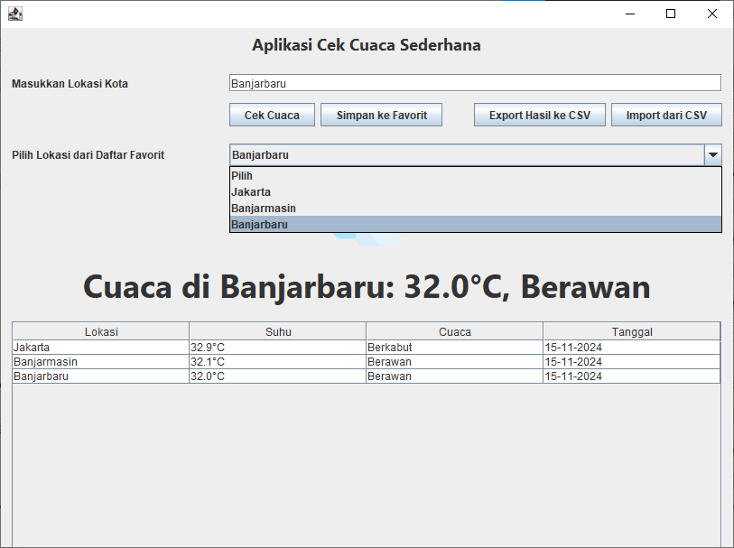
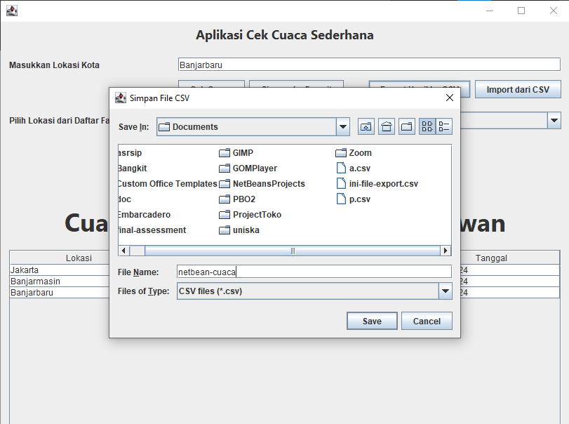
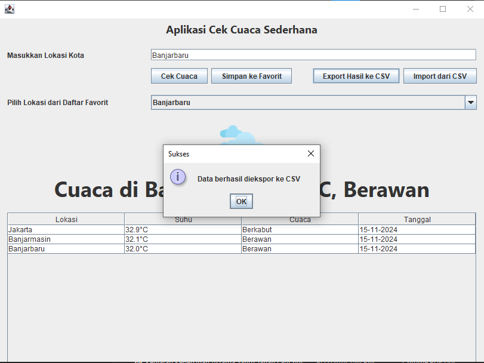
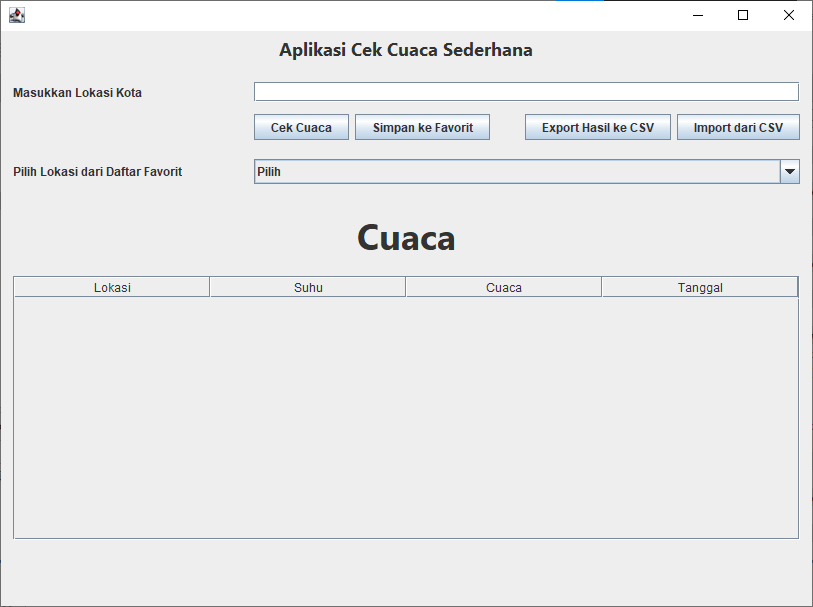
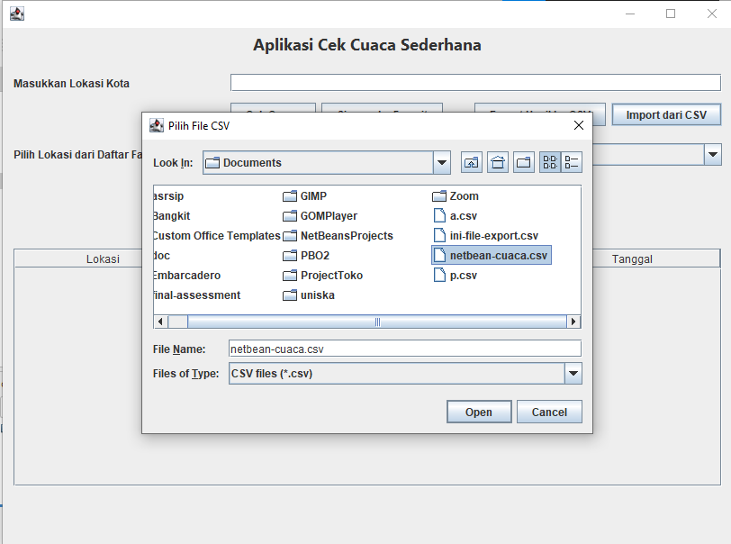
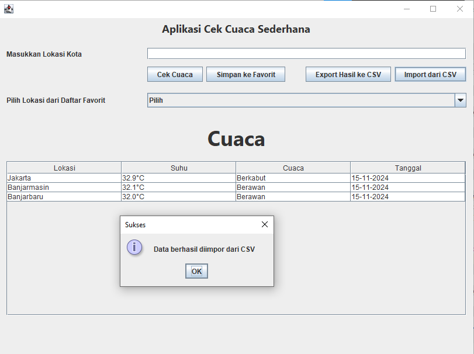

# APLIKASI CEK CUACA SEDERHANA

## Biodata Saya
Nama: Muhammad Junaidi 
NPM: 2210010097 
Kelas: 5B TI Reg BJB Pagi 

## Demo
### Cek Cuaca Aplikasi

### Export Hasil Cek Cuaca ke dalam File CSV
1. Tekan tombol Export dan pilih lokasi menyimpan file yg dinginkan  

2. Klik Save, dan akan muncul pesan Data "berhasil diekspor ke CSV" 

3. File hasil Export  

4. Isi dari File hasil Export  

### Import Data cuaca
File yang diimport disini adalah data cuaca dari file CSV yg  diekspor tadi  
1. Tampilan awal sebelum men-import file CSV  

2. Pilih file yang akan diimport 

3. Data cuaca berhasil diimport 
